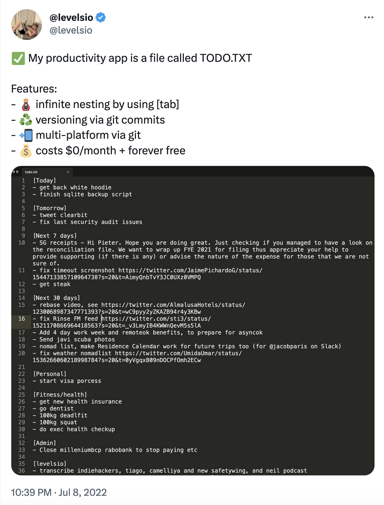

# doto todo ✅

doto is a really simple `todo.txt` manager written in Rust.

I like `todo.txt`s but I also like a little bit of management lol.

<center>
<a target="_blank" href="https://twitter.com/levelsio/status/1545387078816497672">

</a>
</center>

---

All todo files are plaintext `.md` files that look like this:

```
# 2023-05-24
- [x] buy belinda a gift (2023-05-23)
- [ ] train tickets on sunday
- [ ] respond to lily

## pgMagic
- [ ] fix SQL parsing bug
- [>] get licence checks working (2023-05-28)
```

They will open in your `$EDITOR` or vim if you haven't defined it

You can style the text todo files however you would like as long as the task begins with `- [ ]` (to enable task counting and moving capabilities)

The files are saved in your `$DOTO_PATH` directory or `~/.doto`. You can sync this to git or do whatever your want with it.

Open a combined view of the last 4 and next 3 days:

`$ doto`

Open today's todo with

`$ doto today` (`$ doto now` or `$ doto t` also work)

Move all previously undone tasks to today

`$ doto --undone`

Open tomorrow

`$ doto tomorrow` (`$ doto tom`)

Open any day in the current week:

`$ doto tue`

Open any day this month:

`$ doto 21` (to open the 21st this month)

Open a specific date:

`$ doto 2010-12-24`
